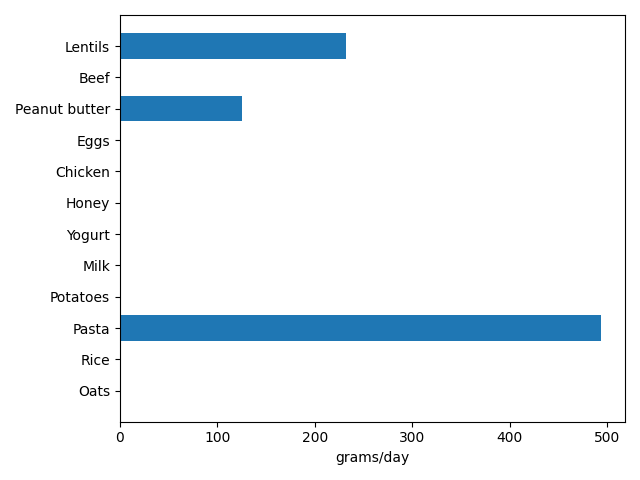

# Optimal Nutrition

A linear programming model that takes in supermarket prices, searches through the USDA nutritional database, and computes the cheapest possible diet that meets your nutritional goals.

## Problem

This is a constrained optimisation problem, much like the 1945 Stigler diet. Stigler's diet was only concerned with survival, so even though technically correct, it was completely impractical.

For this version 1, a simple case was chosen to test the logic. The diet isn't meant to be practical (yet) either, but very well may be in future versions (see **Limitations & future work** section).

A student athlete on a budget may want to structure their diet in a caloric surplus with 2g protein per kg bodyweight. For a physically active 75kg male, the daily intake may look like this: minimum 3300kcal, minimum 150g protein, and fat within 75-100g.

They could manually pick and choose different products to try to meet these constraints, but that would be time-consuming, and may result in various deficiencies, since micronutrients are often neglected in these calculations.

Rather than calculating everything themselves, a better way is to use linear programming (LP) to minimise the cost.

## Approach

This is a classic LP problem:

**Decision variables:** $x_i \ge 0$, servings (100g) of food $i$

**Objective:** Minimise total cost $\sum c_ix_i$

**Constraints:** Nutrient floors/ceilings ($L \le Ax \le U$), per-food caps ($x_i \le M_i$)

Solved with `scipy.optimize.linprog` (HiGHS solver).

The `linprog` function only takes in $Ax \le U$ constraints, hence the $Ax \ge L$ constraints were rearranged into the $-Ax \le -L$ form.

## Data

**Nutrient data:** USDA FoodData Central (Foundation + SR Legacy). Download the **full dataset** ("all data types" CSV, not the individual packages) from [FoodData Central](https://fdc.nal.usda.gov/) and place `food_nutrient.csv` in the project root.

**Prices:** hand-collected from Tesco.com. Date listed in `price.csv`.

Certain nutrients had multiple ids associated with them, so the program uses a fallback system that searches through the next most reliable nutrient id if the amount is missing, and assumes 0 if none was found.

## Results



The example diet chosen out of 15 foods listed in `price.csv` was as follows:

494g spaghetti (dry mass), 125g peanut butter, 232g red lentils (raw mass) costing £1.25 a day.

The LP model favours plant proteins, which is expected since they are often cheaper.

Protein is the binding constraint with the highest shadow price (£0.0180 per g of protein).

## How to run

The USDA CSVs are large (~1.5GB) so they haven't been committed. These must be downloaded first from FoodData Central (see **Data** section) before running.

Files required (project root): `food_nutrient.csv`

Then run the following:
```bash
pip install -r requirements.txt
python main.py
```

## Limitations & future work

Clearly, this diet is not meant to be practical. Plant protein is missing essential amino acids necessary for muscle hypertrophy, and this diet is deficient in all sorts of vitamins and minerals, as well as dietary fibre.

In order to make the diet practical, the model needs to account for other micronutrient constraints, and include a wider choice of products.

Future work will include full implementation of micronutrient balancing, amino acid profiling, a wider selection of products, clearer data presentation, customisation, and much more.
