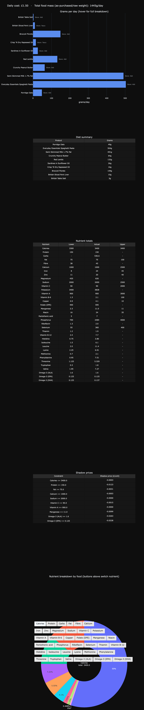

# Least-Cost Diet Optimiser

A linear programming model that takes in supermarket prices, searches through the USDA nutritional database, and computes the cheapest possible diet that meets your nutritional goals.

## Problem

This is a constrained optimisation problem, much like the 1945 Stigler diet. Stigler's diet was only concerned with survival, so even though technically correct, it was completely impractical.

This version minimises cost against targets you define in `constraints.csv`: by default, calories, protein, carbs, fat, fibre, 19 vitamins/minerals, all 9 essential amino acids, and the three main omega-3 fatty acids (ALA/EPA/DHA). Although most of the relevant nutrients are covered, the USDA database keeps poor record of at least 4 other nutrients: Iodine, and Vitamins E, K, and D, so they have been omitted. You can use your own product list and constraints to create a "cheapest diet" of your own. You can install minimum caps on foods that must be in your diet. Take care when using the model. The database is not flawless, and this must not override your own nutritional knowledge or your doctor's advice. To combat unfeasible diets I suggest including a wide variety of nutrient-rich foods recorded in the SR Legacy set.

Here's an example. A student athlete on a budget may want to structure their diet in a caloric surplus with 2g of protein per kg of bodyweight. For a physically active 75kg male, the daily intake may look like this: minimum 3300kcal, minimum 150g protein, and fat within 75-100g.

Rather than relying on tedious calculations and own instincts, a better approach is to use linear programming (LP) to minimise the cost.

## Approach

This is a classic LP problem:

**Decision variables:** $x_i \ge 0$, servings (100g) of food $i$

**Objective:** Minimise total cost $\sum c_ix_i$

**Constraints:** Nutrient floors/ceilings ($L \le Ax \le U$), per-food floors/caps ($m_i \le x_i \le M_i$)

Solved with `scipy.optimize.linprog` (HiGHS solver).

The `linprog` function only takes in $Ax \le U$ constraints, hence the $Ax \ge L$ constraints were rearranged into the $-Ax \le -L$ form.

## Data

**Nutrient data:** USDA FoodData Central, scoped to **SR Legacy foods only**. Foundation Foods (USDA's newer, individually lab-tested records) were tried and dropped: across several tracked micronutrients, coverage was often under 25% (e.g. Vitamin A, Vitamin C, Vitamin B12), against 88-99% for the same nutrients in SR Legacy - Foundation Foods records only report whatever that specific lab analysis tested for, not a full panel.

`food.csv`, `food_nutrient.csv`, and `nutrient.csv` (the **SR Legacy** package, ~36MB total) are committed directly in this repo, so no download is needed to run it as-is. If you want the full multi-data-type dataset instead (e.g. to reintroduce Foundation Foods), download it from the [FoodData Central downloads page](https://fdc.nal.usda.gov/download-datasets) and overwrite these files - that bundle is much larger (~1.5GB), so it isn't committed.

**Prices:** hand-collected from supermarket websites (Tesco/Aldi). Date listed in `price.csv`.

Certain nutrients had multiple ids associated with them, so the program uses a fallback system that searches through the next most reliable nutrient id if the amount is missing, and assumes 0 if none was found.

Even within SR Legacy, a food's different nutrient *panels* (macros, vitamins/minerals, amino acids, fatty acids) were often compiled from separate lab analyses, so one panel can be complete while another is entirely missing on the same record - e.g. English walnuts have full macro data but no recorded ALA at all. `audit_missing_data` (see **Precautions**) is what catches this.

## Customisation

Nutrient targets and food choices are both plain CSVs - no code changes needed to adjust either.

Both lookups below live in one script, `find.py`: run it, then type a search term (it defaults to food search; type `nutrient` to switch modes, `food` to switch back).

**Nutrient targets (`constraints.csv`):** one row per nutrient. `ids` is the comma-separated USDA nutrient id fallback chain (see **Data** above); `lower`/`upper` are the daily bounds, left blank if unconstrained. To track a nutrient not already listed, add a row - find its nutrient id(s) with `find.py` in nutrient mode.

**Foods (`price.csv`):** one row per food, keyed by USDA `fdc_id`. To add a new food:
1. Find its `fdc_id` with `find.py` in food mode (searches **SR Legacy foods only** - see **Data** above for why).
2. Add a row with the pack size/price you found at the shop, plus `min_serving_100g` and `max_serving_100g` (units of 100g) to bound how much of that food the model is allowed to use per day.

## Precautions

This model tracks macros plus whatever nutrients you've added to `constraints.csv`, but not a full RDA panel (e.g. vitamin D/E/K and iodine are deliberately left out - adding all four together made the model infeasible with this food list). A cost-minimal diet can still be nutritionally incomplete in ways that aren't tracked.

The `min_serving_100g` floor is a manual safeguard on top of that: forcing in a minimum daily amount of a food you know is nutrient-dense hedges against gaps in what's modelled. This is a deliberate simplification, not a guarantee of nutritional completeness.

USDA/SR Legacy is a US database, so a `price.csv` row is sometimes matched to the closest available record rather than an exact one - e.g. "Semi Skimmed Milk 1.7% Fat" is priced from the UK product, but its nutrient data comes from a USDA "reduced fat, 2% milkfat" record, since SR Legacy has no UK-style 1.7% entry (noted in `price.csv`'s `notes` column). The gap is small, but worth knowing about for any food where this happens, especially one making up a large share of the diet by weight.

USDA nutrient data can also be incomplete for a specific food record, even within SR Legacy - `build_matrix` assumes 0 if no fallback id has data, which is indistinguishable from a food genuinely having none of that nutrient (see **Data** above on independently-missing panels). Two checks catch what they can, printed to the console whenever you run `main.py`: **`audit_calories`** flags a food whose reported calories don't roughly match its macros (`4·protein + 4·carbs + 9·fat`), usually a sign of a missing/incomplete energy value; **`audit_missing_data`** flags any food with zero USDA rows at all for a tracked nutrient, grouped one line per food. It auto-suppresses the amino-acid/omega-3 case where the food's own Protein/Fat figure is near zero (nothing to measure), so what's left is either a real gap or expected. Neither check *fixes* anything - read the warnings; they're telling you where the model is guessing 0 instead of knowing. This is not dietary advice. Use at your own (and your doctor's) discretion.

## Results



Running the current `price.csv`/`constraints.csv` (SR Legacy foods, macros + 19 vitamins/minerals + 9 essential amino acids + 3 omega-3s) gives:

**£1.50/day**, 1445g total mass:

- Porridge Oats: 49g
- Spaghetti Pasta: 504g
- Semi Skimmed Milk: 491g
- Peanut Butter: 64g
- Red Lentils: 132g
- Sardines: 26g
- Rapeseed Oil: 16g
- Broccoli: 149g
- Pork Liver: 10g
- Table Salt: 3g

In my opinion, this seems way better than the Stigler diet. Not only does it meet more constraints (9 EAAs, to say the least), it also seems fairly plausible.

The two most expensive constraints to satisfy pound-for-pound are now **Omega-3 ALA and EPA** (shadow prices £0.026/g and £0.023/g) - ALA because Rapeseed Oil is the cheapest source in the pool, EPA because Sardines is the *only* source at all (plant foods don't naturally contain EPA/DHA). Protein and Manganese follow behind. None of the 9 amino acid floors are actually binding - the Protein floor alone already supplies more than enough of each.

## How to run

The USDA CSVs needed to run this (`food.csv`, `food_nutrient.csv`, `nutrient.csv`) are committed in the repo - see **Data** if you want the full dataset instead. Clone the repo, then run:
```bash
pip install -r requirements.txt
python main.py
```

This opens an interactive, dark-themed dashboard in your browser:
- a bar chart of grams/day per food (hover any bar for its full nutrient breakdown; store shown alongside each bar)
- a plain diet summary table (product + grams only)
- a nutrient totals table (lower bound / actual / upper bound per tracked nutrient)
- a shadow price table (which constraints are binding, and how much an extra unit of each would cost)
- a pie chart with a button per nutrient, switching the chart to show that nutrient's breakdown across foods
